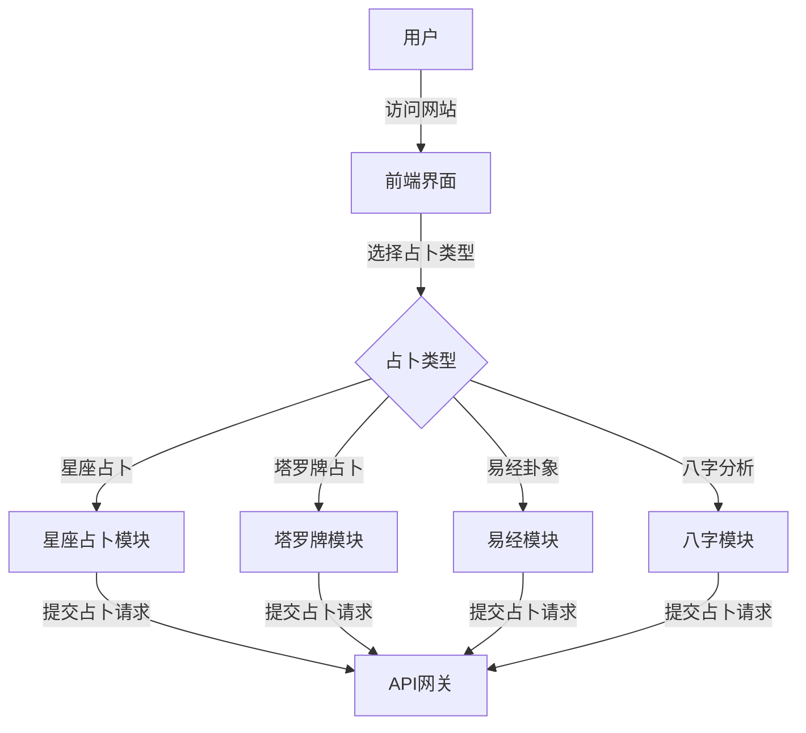
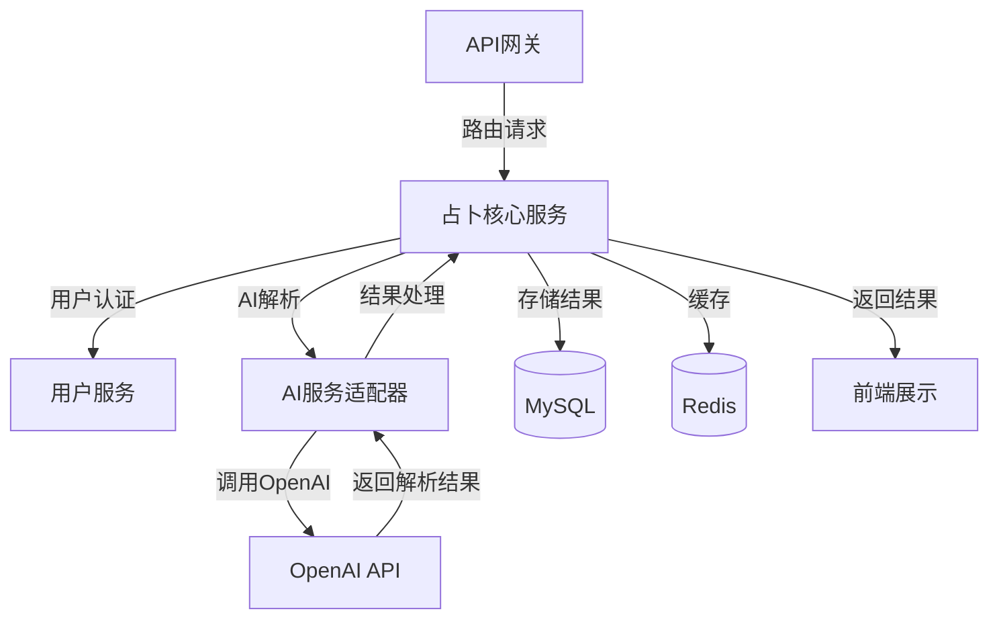
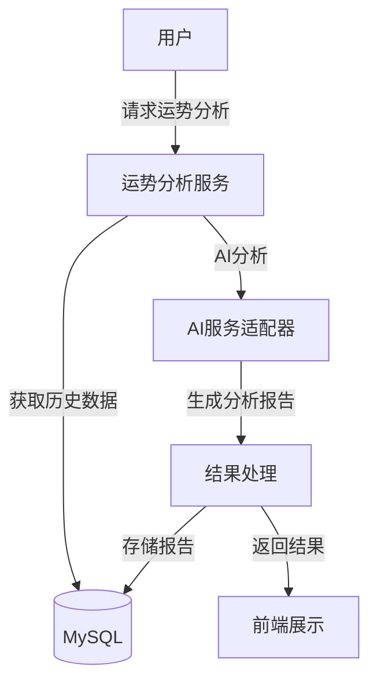
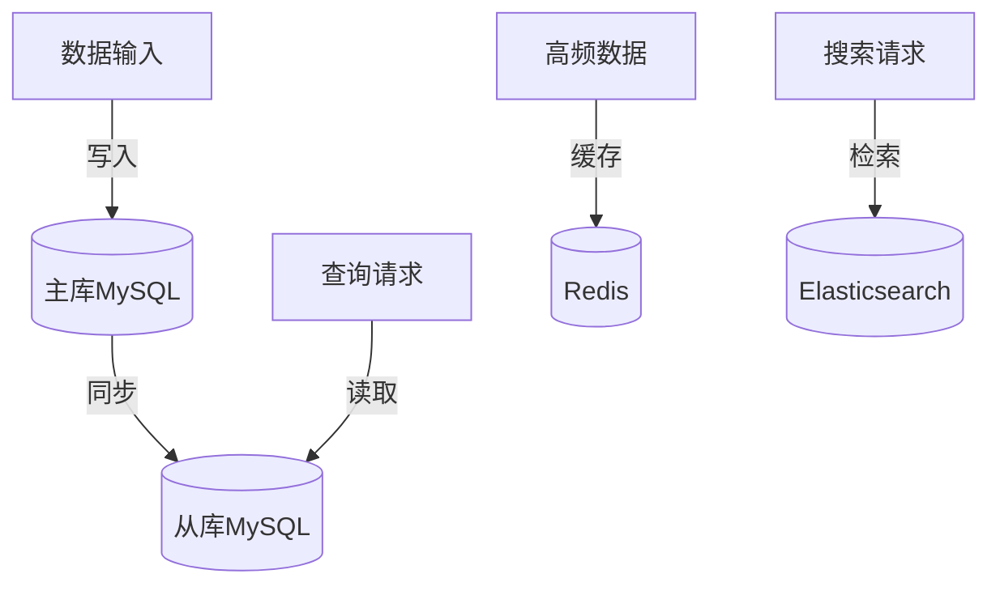

# 系统流程图

## 用户交互流程

```mermaid
graph TD
    A[用户] -->|访问网站| B[前端界面]
    B -->|选择占卜类型| C{占卜类型}
    C -->|星座占卜| D[星座占卜模块]
    C -->|塔罗牌占卜| E[塔罗牌模块]
    C -->|易经卦象| F[易经模块]
    C -->|八字分析| G[八字模块]
    D & E & F & G -->|提交占卜请求| H[API网关]
```

## 后端处理流程

```mermaid
graph TD
    A[API网关] -->|路由请求| B[占卜核心服务]
    B -->|用户认证| C[用户服务]
    B -->|AI解析| D[AI服务适配器]
    D -->|调用OpenAI| E[OpenAI API]
    E -->|返回解析结果| D
    D -->|结果处理| B
    B -->|存储结果| F[(MySQL)]
    B -->|缓存| G[(Redis)]
    B -->|返回结果| H[前端展示]
```

## 运势分析流程

```mermaid
graph TD
    A[用户] -->|请求运势分析| B[运势分析服务]
    B -->|获取历史数据| C[(MySQL)]
    B -->|AI分析| D[AI服务适配器]
    D -->|生成分析报告| E[结果处理]
    E -->|存储报告| C
    E -->|返回结果| F[前端展示]
```

## 数据处理流程

```mermaid
graph TD
    A[数据输入] -->|写入| B[(主库MySQL)]
    B -->|同步| C[(从库MySQL)]
    D[查询请求] -->|读取| C
    E[高频数据] -->|缓存| F[(Redis)]
    G[搜索请求] -->|检索| H[(Elasticsearch)]
```